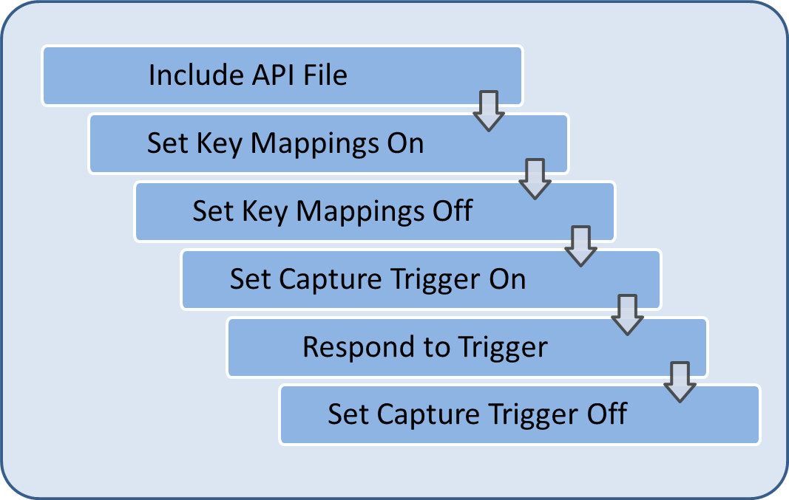
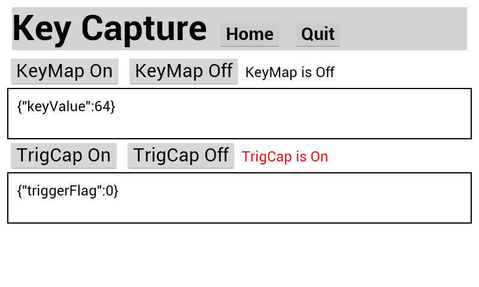
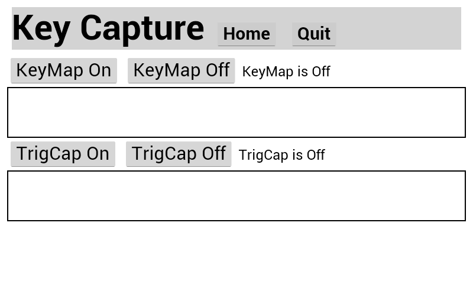
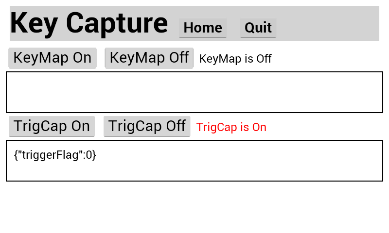
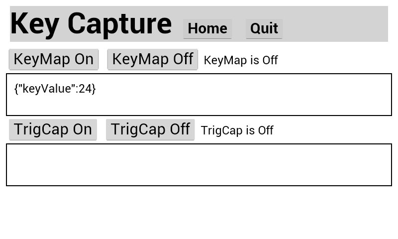
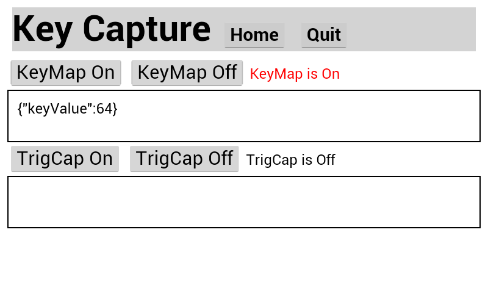



This tutorial covers the use of the Enterprise Browser KeyCapture API to remap hardware keys and assign actions to the device hardware trigger.

##Prerequisites

The following are required to complete this tutorial:

* A background in HTML, CSS and JavaScript coding
* Enterprise Browser installed on a development PC 
* A Zebra mobile device and USB cable
* Enterprise Browser installed on the Zebra device 

##Coding for the KeyCapture API

Enterprise Browser includes an API for remapping key codes and assigning functions to hardware keys. The steps shown below are typical for code that uses this API. The following tutorial will walk through creating a working example application using these steps. 

The resulting example application will look like this:

## Creating the App

The following HTML template will be used as a starting point for this tutorial. It includes the following features:

* Home button that returns the user to the Enterprise Browser start page. 
* Quit button that exits Enterprise Browser. 
* Styling to size components in an appropriate manner for use on a device. 
* Buttons to turn trigger and key capture on and off. 

HTML Starter Template:

    :::html
    <HTML>
      <HEAD>
        
      
      </HEAD>
    <BODY>
      <h1>Key Capture
        <button onclick="window.location.href='./index.html'">Home</button>
        <button onclick="EB.Application.quit();">Quit</button>
      </h1>
      

        <input type=button value="KeyMap On" >
        <input type=button value="KeyMap Off" >
        KeyMap is Off
      

      

        
      

      

        <input type=button value="TrigCap On" >
        <input type=button value="TrigCap Off" >
        TrigCap is Off
      

        

        
      

    </BODY>
    
    </HTML>

###STEP 1: Create the application file

* **Create a directory** on your development machine for application files.
* **Create a file named `keycap.html`** in your application directory and open it in a text editor.
* **Copy the contents of the starter template above** into the file and save it.

###STEP 2: Include the API JavaScript file

* **Copy the `ebapi-modules.js` file** from `C:\EnterpriseBrowser\JavaScriptFiles\EnterpriseBrowser`  
to your application directory. The KeyCapture API requires this JavaScript file.
 
* **Add the following to `keycap.html` as the first line in the HEAD** section: 

Sample HTML:

    :::HTML
    

###STEP 3: Capture and display key values

To verify that key mappings are functioning properly, we need a way to identify key codes of keys that are being pressed. To do this, we will run the following code on startup to capture the keys and send their value to an element for display. 

* **In the `keycap.html` file, insert the following code into the upper script section**, which is in the HEAD section: 

Sample JavaScript:

    :::JavaScript
    function keycapOn(){
        EB.KeyCapture.captureKey(false,'all', function(param){
            document.getElementById('keyvalue').innerHTML = JSON.stringify(param);
        });
    }

* **Replace the starting BODY tag** with the one that contains an `onload` statement as shown here: 

Sample HTML:

    :::HTML
    <BODY onload="keycapOn();">

###STEP 4: Turn key mappings on 
* **Add the `fnKeyMapOn()` method** in the SCRIPT section **between the end BODY tag and the end HTML tag**:  

Sample JavaScript: 

    :::JavaScript
    function fnKeyMapOn() {
      EB.KeyCapture.remapKey(24, 64);
      EB.KeyCapture.remapKey(25, 65);
      EB.KeyCapture.remapKey(82, 66);
      document.getElementById('keymap').innerHTML = "KeyMap is On";
      document.getElementById('keymap').style.color = "red";
    }

In the first three lines of code above, three keys are remapped: the volume-up and volume-down keys and the menu softkey on a TC55. After that we set a text indicator letting the user know that key mapping has been turned on. If you're working with a device other than the TC55, you'll be able to adjust which keys are mapped in a later step.

###STEP 5: Turn key mappings off
The next function provides a way to remap and reset the keys. 

* **Add the method `fnKeyMapOff()` at the bottom of the SCRIPT section**, which is between the end BODY tag and the end HTML tag:

Sample JavaScript:

    :::JavaScript
    function fnKeyMapOff() {
      EB.KeyCapture.remapKey(24, '');
      EB.KeyCapture.remapKey(25, '');
      EB.KeyCapture.remapKey(82, '');
      document.getElementById('keymap').innerHTML = "KeyMap is Off";
      document.getElementById('keymap').style.color = "black";
    }

In this method, we reset the key mappings by calling the same `remapKey()` method and setting the second parameter to an empty string. After resetting the keys, the method modifies the text indicator to show the user that key mapping has been turned off.

###STEP 6: Turn capture trigger on

The KeyCapture API also lets us map a custom function onto the device's trigger key.  

* **Add method `fnTrigCaptureOn()` at the bottom of the SCRIPT section**, which is between the end BODY tag and the end HTML tag:

Sample JavaScript:

    :::JavaScript
    function fnTrigCaptureOn()  { 
      EB.KeyCapture.captureTrigger(onCaptureTrigger);
      document.getElementById('trigcap').innerHTML = "TrigCap is On";
      document.getElementById('trigcap').style.color = "red";
    }

This method calls the `captureTrigger()` method and passes a function that will then be called whenever the hardware trigger key is pressed. A text indicator is set so that the user knows that the trigger capture is in effect. 

###STEP 7: Respond to the trigger
* **Add the trigger callback method `fnImgCaptureDisable()`** at the bottom of the SCRIPT section, which is between the end BODY tag and the end HTML tag:

Sample JavaScript:

    :::JavaScript
    function onCaptureTrigger(parms){
      document.getElementById('triggervalue').innerHTML = JSON.stringify(parms);
    }

The callback simply echoes the callback parameters to a display area on the screen. In a real application, you might use this callback function to open a screen or begin a process.  

###STEP 8: Turn capture trigger off

* **Add the method `fnTrigCaptureOff()` at the end of the SCRIPT section**, which is between the end BODY and end HTML tags:

Sample JavScript:

    :::JavaScript
    function fnTrigCaptureOff() { 
      EB.KeyCapture.captureTrigger();
      document.getElementById('trigcap').innerHTML = "TrigCap is Off";  
      document.getElementById('trigcap').style.color = "black";
    }

This method resets the capture trigger by removing the callback function from the trigger key and calling the same `captureTrigger()` method without a callback function.

###STEP 9: Hook the JavaScript methods to buttons

Now that the JavaScript functions have been created, we can hook them up to the control buttons.

* **In `keycap.html`, append `onClick` handler code to the button tags** we created earlier in the `controls div` section, (or **simply replace the two corresponding `div` sections with the function-appended ones below**):

Sample HTML:

    :::HTML
    

      <input type=button value="KeyMap On"   onClick="fnKeyMapOn();"  >
      <input type=button value="KeyMap Off"  onClick="fnKeyMapOff();" >
      KeyMap is Off
    

    

      <input type=button value="TrigCap On"  onClick="fnTrigCaptureOn();" >
      <input type=button value="TrigCap Off" onClick="fnTrigCaptureOff();" >
      KeyTrap is Off
    

###STEP 10: Copy files to the device

To test the application, you need to copy the application files to the device and set the StartPage setting in the Enterprise Browser `config.xml` file. Android- and Windows-based devices use different methods for transferring files. Please see the documentation for your device for specific instructions on copying files. 

In general, here's what is required:

1. **Create a directory on your device** for the KeyCapture application. Make sure the directory is in an unrestricted location to avoid any permissions issues when Enterprise Browser tries to open the files. We'll place our sample app's files in the device's root directory and show you how to modify the `config.xml` file accordingly. 
2. **Copy the `keycap.html` and any JavaScript API files** you have included to the directory you created on the device. 
3. **Copy the `config.xml` file to a suitable location on the development machine** from the Enterprise Browser install directory on the device and open it in a text editor. 
4. **Update the StartPage setting in `config.xml` to point to the location on the device** where you placed `keycap.html` and save the changes. 
5. **Copy the `config.xml` file back to its original location on the device**.

Sample `config.xml` showing path to Android app in root directory: 

    :::HTML
        <General>
            <Name value="KeyCapture"/>
            <StartPage value="file:///keycap.html" name="KeyCapture"/>
            <UseRegularExpressions value="1"/>
        </General>

###STEP 11: Testing the App
* **Tap the Enterprise Browser icon** on the device. If the device is not yet licensed for Enterprise Browser you will see the following screen:

* **Click on the cancel button** in the upper right hand corner of the screen to dismiss the message and open the Key Capture app. If you turn the device sideways it should look like this:

* **Click the trigger button** on the device to test the trigger function. Nothing should happen. If something happens at this point there may be something attached to the trigger via DataWedge. Find the DataWedge application, make sure that any profiles have been deactivated then return to the key capture app. 

* **Click on the TrigCap On button**. The text indicator "TrigCap is on" will be displayed  in red. 

* **Click the trigger button on the device again**. This time it should activate the callback and you should see evidence of the action in the display area like this:

* **Click the TrigCap Off button**. The text indicator "TrigCap is off" should appear in black. Pressing the device's hardware trigger will no longer activate the callback function.

* To test the key mapping functions, **click on a few of the device's hardware buttons** or a soft button like the Menu button (soft key) on the TC55. You should see the key value appear in the key mapping display area. Since we have not yet turned on the mapping what you see here will be the true unmapped value of the key. 

In the case shown below, we've clicked on the volume-up key, which has an unmapped value of 24 on the TC55 device. The value on your device may be different.

* **Now click the KeyMap On button**. The text indicator "KeyMap is on" should appear in red. Try pressing the up volume key again. If the up volume value before was 24 it should now show as the remapped value of 64. 

**If the key values on your device differ**, you will need to go back to the `fnKeyMapOn()` and modify the mappings. For each of the `remapKey()` methods, set the first parameter to match the actual unmapped value of one of the hardware keys on your device. Set the second parameter to be the value you want to map it to.

Sample JavaScript:

    :::JavaScript
    function fnKeyMapOn() {
      EB.KeyCapture.remapKey(24, 64);
      EB.KeyCapture.remapKey(25, 65);
      EB.KeyCapture.remapKey(82, 66);
      document.getElementById('keymap').innerHTML = "KeyMap is On";
      document.getElementById('keymap').style.color = "red";
    }

* Any changes to the key mapping method also should be applied to the `fnKeyMapOff()` method, except that the second parameter should always be an empty string.

Sample JavaScript: 

    :::JavaScript
    function fnKeyMapOff() {
      EB.KeyCapture.remapKey(24, '');
      EB.KeyCapture.remapKey(25, '');
      EB.KeyCapture.remapKey(82, '');
      document.getElementById('keymap').innerHTML = "KeyMap is Off";
      document.getElementById('keymap').style.color = "black";
    }

* After making the changes, **copy the app files over to the device and open the application**. Try pressing the mapped hardware keys to show their unmapped values. Then press the KeyMap On button and try the hardware keys again. You should now see the mapped value. 

###Conclusion
This completes the Enterprise Browser KeyCapture API tutorial. For more information on the KeyCapture API, please refer to the [Enterprise Browser API documentation](../../api/keycapture).

