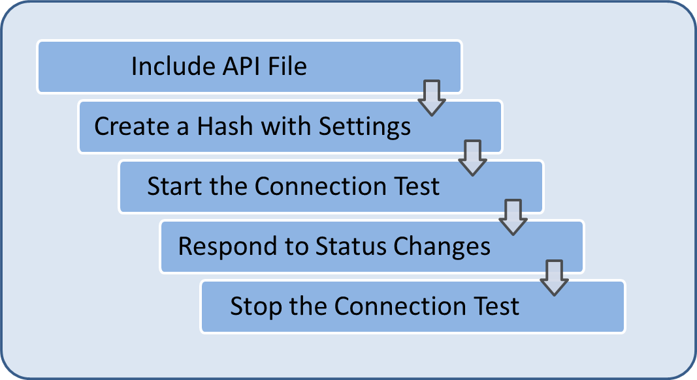
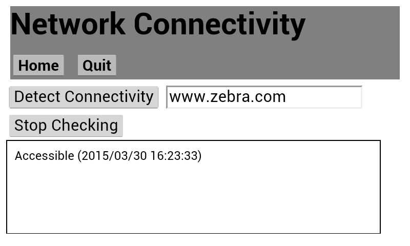
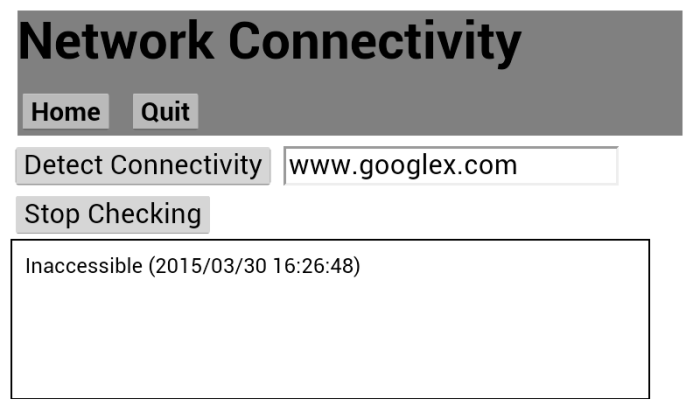



This tutorial covers the use of the Enterprise Browser Network API to detect network connection state.

##Prerequisites

The following are required to complete this tutorial:

* A background in HTML, CSS and JavaScript coding
* Enterprise Browser installed on a development PC
* A Zebra mobile device and USB cable
* Enterprise Browser installed on the Zebra device

##Coding for the Network API
Enterprise Browser includes an API for working with WAN and WiFi networks. The steps shown below are typical for code that uses this API. The following tutorial will walk through creating a working example application using these steps. The application checks for server connectivity status based on a given URL.  

The resulting example application looks like this:

##Creating the App

The following HTML template will be used as a starting point for this tutorial. It includes the following features:

* Home button that returns the user to the Enterprise Browser start page. 
* Quit button that exits Enterprise Browser. 
* Styling to size components in an appropriate manner for use on a device. 
* An element for displaying the status of a connection.

HTML Starter Template:

    :::HTML
    <HTML>
      <HEAD>
        
      </HEAD>
      <BODY>
        <h1>Network Connectivity
          <button onclick="window.location.href='./index.html'">Home</button>
          <button onclick="EB.Application.quit();">Quit</button>
        </h1>
        

        

        

          Connectivity status goes Here
        

      </BODY>
    
    </HTML>

###STEP 1: Create the application file

* **Create a directory** on your development machine for application files. 
* **Create a file named `netcon.html`** in your application directory and open it in a text editor.
* **Copy the contents of the starter template** above into the file and save it.

###STEP 2: Add URL input and control buttons
* **In `netcon.html`, add two buttons and an input area into the controls div.** 

Sample HTML: 

    :::HTML
    <button>Detect Connectivity</button>
    <input type=text  id="host" value = "www.zebra.com">
    <button>Stop Checking</button>

The first button will call the API to start polling the connection. The input element will provide the URL to poll for. The second button will call the API to stop polling the connection. 

###STEP 3: Include the API JavaScript file
* **Copy the `ebapi-modules.js` file** from
`C:\EnterpriseBrowser\JavaScriptFiles\EnterpriseBrowser` 
to your application directory. This JavaScript file is required by the Network API.

* **Add the following as the first line in the HEAD section**: 

Sample HTML: 

    :::HTML
    

###STEP 4: Create a hash with settings, start connection test

* **Add the method `fnDetectConnection()` to the SCRIPT section**, which is between the end BODY tag and the end HTML tag. 

Sample JavaScript: 

    :::JavaScript
    function fnDetectConnection() {
      var hostval = document.getElementById("host").value;
      var parms_hash = {
        host: hostval,
        pollInterval: 5000,
        detectionTimeout: 1000
      };
      EB.Network.detectConnection(parms_hash, onConnectionStatusChange);
    } 

The `params_hash` parameter hash includes settings for the host URL, `pollInterval` and `detectionTimeout`. The `pollInterval` sets the time between each check, in milliseconds. The `detectionTimeout` determines how long the connection check waits before determining that the connection is disconnected. The hash is passed to the `detectConnection` method along with the name of a method that will be called whenever the API detects a change in status. 

###STEP 5: Respond to status changes

We need to add the callback function that was passed to `detectConnection()` in the previous method. 

* **Add `onConnectionStatusChange()` at the end of the SCRIPT section**. This method displays a message regarding the connection status to the user. 

Sample JavaScript: 

    :::JavaScript
    function onConnectionStatusChange(parms) {
      var msg = (parms.connectionInformation  == "Connected")?"Accessible":"Inaccessible";
      document.getElementById("constatus").innerHTML = msg + " (" + getDateTime() + ")";
    }

Our callback method uses a utility function to display a date and time along with each status message. 

* **Add the following function at the end of the SCRIPT section**:

Sample JavaScript: 

     :::JavaScript
      function getDateTime() {
        var now     = new Date(); 
        var year    = now.getFullYear();
        var month   = now.getMonth()+1; 
        var day     = now.getDate();
        var hour    = now.getHours();
        var minute  = now.getMinutes();
        var second  = now.getSeconds(); 
        if(month.toString().length == 1) {
            var month = '0'+month;
        }
        if(day.toString().length == 1) {
            var day = '0'+day;
        }   
        if(hour.toString().length == 1) {
            var hour = '0'+hour;
        }
        if(minute.toString().length == 1) {
            var minute = '0'+minute;
        }
        if(second.toString().length == 1) {
            var second = '0'+second;
        }   
        var dateTime = year+'/'+month+'/'+day+' '+hour+':'+minute+':'+second;   
         return dateTime;
      }

###Step 6: Stop the connection test
The next function will be used to cancel the connection polling that was started by the call to `detectConnection()`. 

* **Add the following method to the end of the SCRIPT section**:

Sample JavaScript: 

    :::JavaScript
    function fnStopChecking() {
      EB.Network.stopDetectingConnection();
      document.getElementById("constatus").innerHTML = "Connectivity status goes here";
    }

###STEP 7: Hook JavaScript method to buttons 

Now that the JavaScript functions have been created, we can hook them to the control buttons.  

* **Add `onClick` handler code to the input button tags** we created earlier (or **simply replace the contents of the `content div` section inserted earlier with the function-appended code below**):

Sample HTML: 

    :::HTML
    <button onClick="fnDetectConnection()">Detect Connectivity</button>
    <input type=text  id="host" value = "www.zebra.com">
    <button onClick="fnStopChecking()">Stop Checking</button>

###STEP 8: Copy files to the device

To test the application, you need to copy the application files to the device and set the StartPage setting in the Enterprise Browser `config.xml` file. Android- and Windows-based devices use different methods for transferring files. Please see the documentation for your device for specific instructions on copying files. 

In general, here's what is required:

1. **Create a directory on your device** for the Netcon application. Make sure the directory is in an unrestricted location to avoid any permissions issues when Enterprise Browser tries to open the files. We'll place our sample app's files in the device's root directory and show you how to modify the `config.xml` file accordingly.
2. **Copy the `netcon.html` and any JavaScript API files** you have included to the directory you created on the device. 
3. **Copy the `config.xml` file to a suitable location on the development machine** from the Enterprise Browser install directory on the device and open it in a text editor. 
4. **Update the StartPage setting in `config.xml` to point to the location on the device** where you placed `netcon.html` and save the changes. 
5. **Copy the `config.xml` file back to its original location on the device**.    

Sample `config.xml` showing path to Android app in root directory: 

    :::HTML
        <General>
            <Name value="Network"/>
            <StartPage value="file:///network.html" name="Network"/>
            <UseRegularExpressions value="1"/>
        </General>

###STEP 9: Testing the App
* **Tap the Enterprise Browser icon** on the device. If the device is not yet licensed for Enterprise Browser you will see the following screen:

* **Click on the cancel button** in the upper right hand corner of the screen to dismiss the screen and open the Network app. If you turn the device sideways it should look like this:

* **Click on the Detect Connectivity button**. The API will start checking for a connection to the site www.zebra.com. When it determines the connection status it will activate the callback which will display a message to the user:

* **Click on Stop Checking** to stop polling the connection.

* **Try checking with a different URL**. 

* **Try checking with an invalid URL**. You should get a message saying that the connection is inaccessible.

###Conclusion
This completes the Enterprise Browser Network API tutorial.  For more information on the Network API see the [Enterprise Browser API documentation](../../api/Network).

